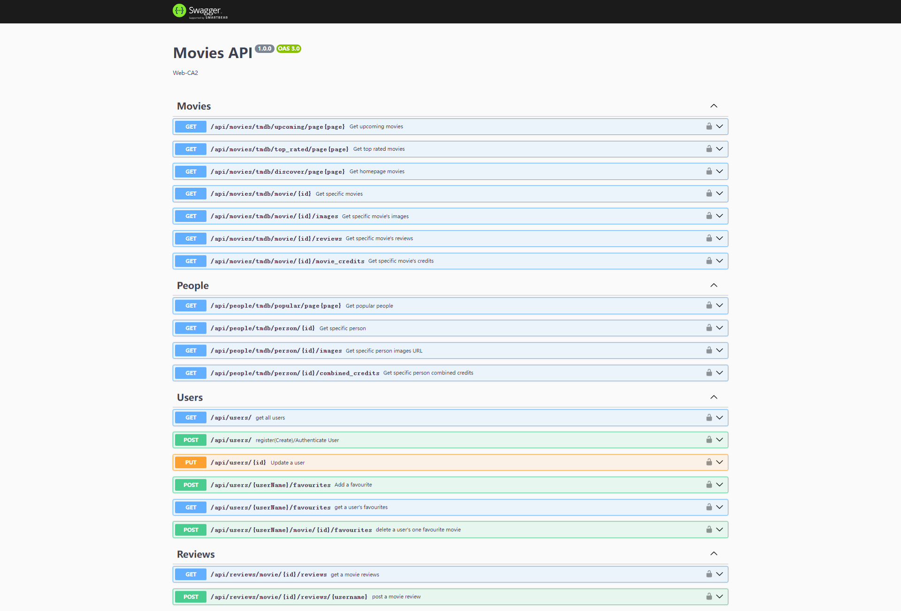
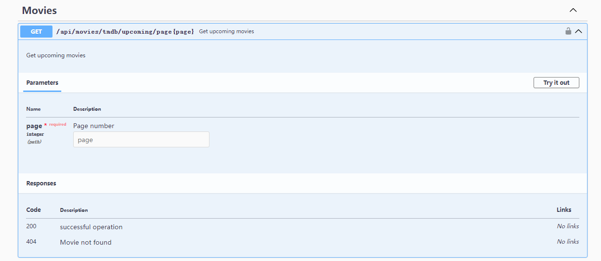
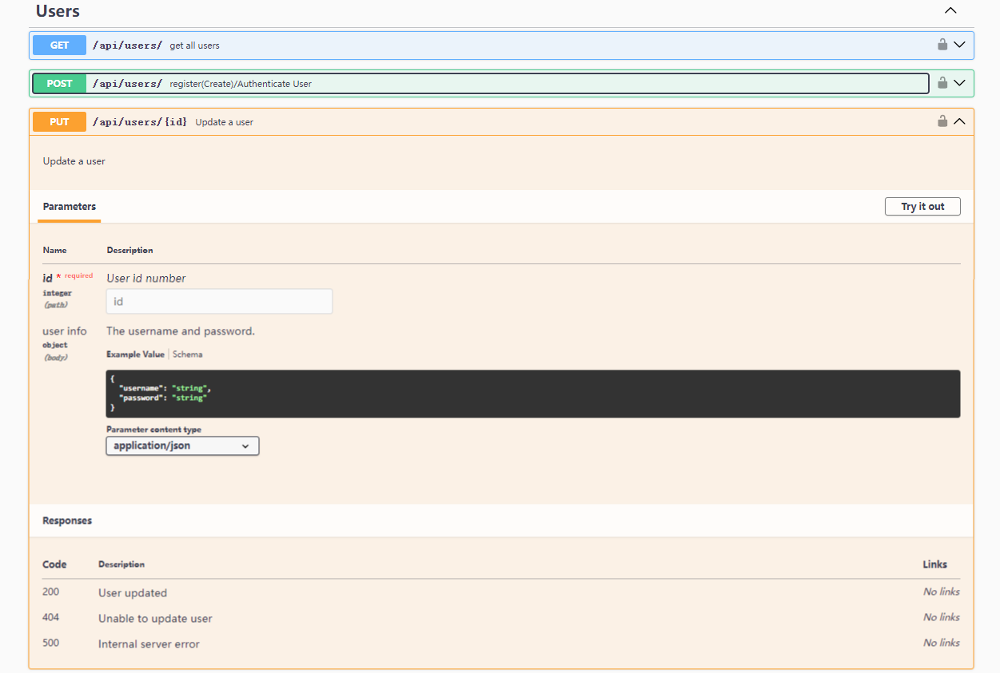
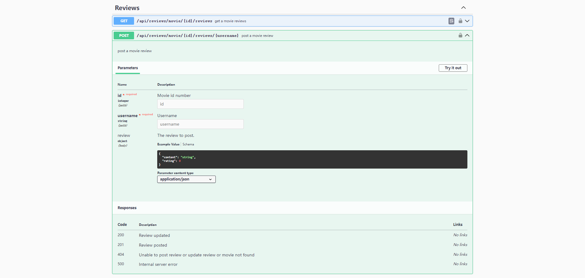

# Assignment 2 - Web API.

Name: MingJu Sun

## Features.

+ Authentication service is provided by Movies-API
+ Some pages require user authentication to be viewed.
+ Favourites and comments can only be used after the user has logged in
+ The user logs in and comments on the film, which is stored in the database
+ Most APIs now support error handling and have new express middleware.
+ Using swagger
## Setup requirements.
In the corresponding file terminal, enter
`npm install`  
`npm start`  

## API Configuration

 + create a `.env` file, the following should be included:
    ______________________
    NODE_ENV=development  
    PORT=8080   
    HOST=localhost  
    MONGO_DB=YourMongoURL  
    SEED_DB=True  
    SECRET=YourJWTSecret  
    REACT_APP_TMDB_KEY=YourTMDBApiKey  
    ______________________

## API Design  

After running movies-api server,you can see these apis by visiting the website:  [swagger(http://localhost:8080/api-docs/)](http://localhost:8080/api-docs/)

Here are some screenshots

### [Movies](movies-api/api/movies/index.js)  
+ /api/movies/tmdb/discover/page:page | GET | Gets a list of movies for the home page.  
+ /api/movies/tmdb/upcoming/page:page | GET | Gets a list of movies for the upcoming movie page.   
+ /api/movies/tmdb/movie/:id | GET | Gets a single movie's detail for the movie details page.  
+ /api/movies/tmdb/movie/:id/images | GET | Gets a single movie's images.  
+ /api/movies/tmdb/movie/:id/reviews | GET | Gets a single movie's reviews.  
+ /api/movies/tmdb/movie/:id/movie_credits | GET | Gets a single movie's credits.  

### [People](movies-api/api/people/index.js)  
+ /api/people/tmdb/popular/page:page | GET | Gets popular people for popular people page.  
+ /api/people/tmdb/person/:id | GET | Gets a single person's detail for the person details page.  
+ /api/people/tmdb/person/:id/images | GET | Gets a single person's images.  
+ /api/people/tmdb/person/:id/combined_credits | GET | Gets a single person's combined credits.  

### [Reviews](movies-api/api/reviews/index.js)    
+ /api/reviews/movie/:id/reviews | GET | Gets a single movie's reviews both from TMDB and MONGODB.  
+ /api/reviews/movie/:id/reviews/:username | POST | Posts or updates a review from the logged in user for a single movie.  

### [Users](movies-api/api/users/index.js)  
+ /api/users/ | GET | Gets all users.  
+ /api/users/ | POST | Registers/Authenticates a user. The body should include username and password.  
+ /api/users/:id | Put | Updates a single user's information.  
+ /api/users/:userName/favourites | POST | Add a single movie to a single user's favourites. The body should include the movie's id.
+ /api/users/:userName/favourites | GET | Gets a single user's all favourite movies.  
+ /api/users/:username/movie/:id/favourites | POST | Delete a speicfic movie from a single user's all favourite movies.

## Security and Authentication

The application no longer uses Firebase, but utilises JWT authentication. Movie favourites and reviews are only available to logged in users. 
+ Favourite Movies Page (/movies/favorites/)
+ The Review Form Page (/reviews/form/)

## Integrating with React App

All [api](#api-design) are now from movies-api and now most are with error logs.  
+ Access to the protected page will require the user to register/login first 
+ Movie favourites and reviews are only available to logged in users.   
+ Use regular expressions to restrict users from entering non-compliant passwords during registration 
+ User comments are stored in the database and can be viewed by other logged in users 

## Independent learning (if relevant)

Learn and use swagger to document the APIs of my Assignment.
+ Reference: [https://editor.swagger.io/](https://editor.swagger.io/)  
